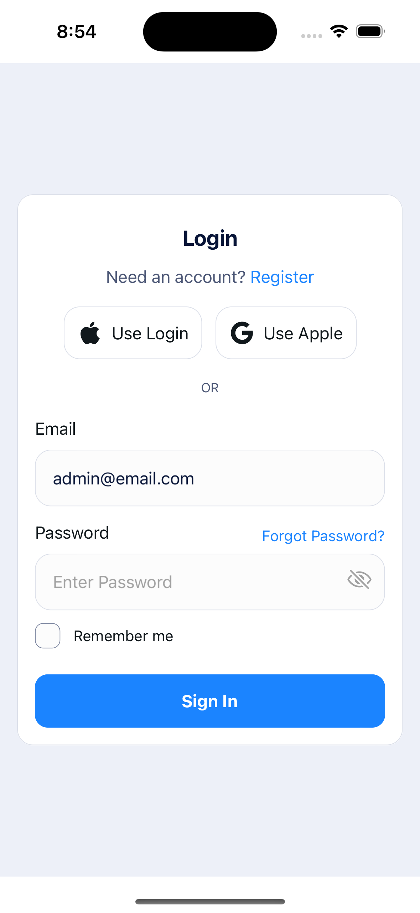
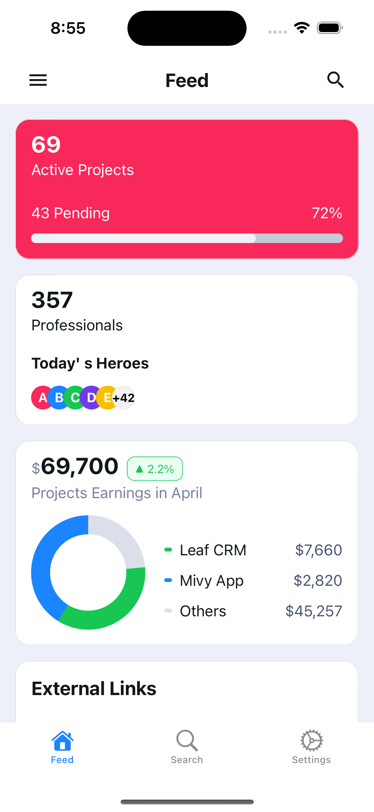
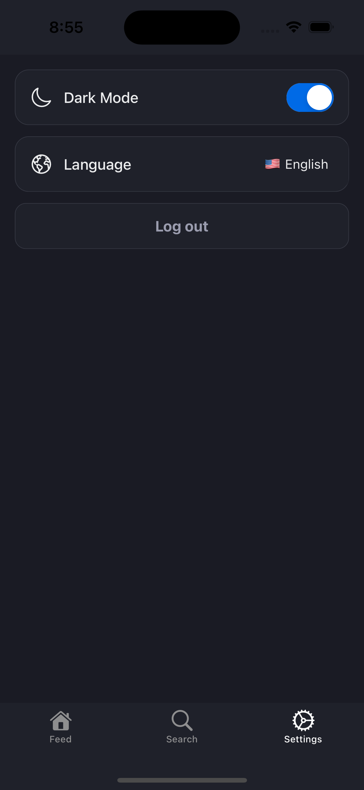
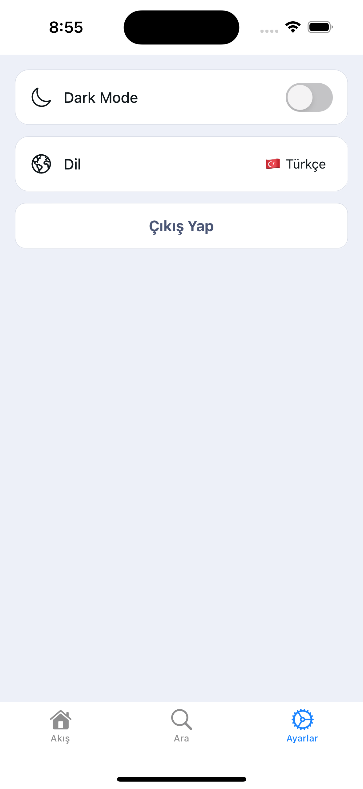

# React Native Expo Architecture Template

A modern, feature-rich mobile application template built with React Native and Expo. This template provides a robust foundation for building scalable mobile applications with built-in internationalization, theming, navigation, and reusable components.

## 🌟 Screenshots (Auth, Dark Mode, Multi-language and Dashboard)

<div style="display: flex; flex-wrap: wrap; gap: 10px;">









</div>

## 🌟 Key Features

- 📱 File-based routing with Expo Router
- 🌍 Built-in internationalization (i18n) support (English & Turkish)
- 🎨 Customizable theming system
- 📊 Interactive charts and data visualization
- 🔐 Authentication flow
- 🎯 Type-safe navigation
- 📝 Form handling
- 🧩 Reusable UI components
- 🔄 State management with Redux Toolkit
- 🎭 Dark/Light mode support

## 📁 Project Structure

```
├── app/ # Main application directory
│ ├── (drawer)/ # Drawer navigation screens
│ ├── (tabs)/ # Tab-based navigation screens
│ ├── components/ # Reusable components
│ ├── constants/ # App constants and theme
│ └── utils/ # Utility functions
├── assets/ # Static assets (images, fonts)
├── providers/ # Context providers and dependency injection containers
├── hooks/ # General Custom Hooks
├── constants/ # Values used in all app likes styles, typography etc.
├── api/ # API services, endpoints, and network related utilities
├── screens/ # Screen components and their specific logic
├── types/ # TypeScript interfaces, types and type definitions
├── utils/ # Helper functions, formatters, and utility methods
├── localization/ # i18n translation files
└── store/ # Redux store configuration
```

## 🚀 Getting Started

### Prerequisites

- Node.js (v16 or newer)
- npm or yarn
- Expo CLI
- iOS Simulator (Mac only) or Android Studio

### Installation

1. Clone the repository:
```bash
git clone [repository-url]
```

2. Install dependencies:
```bash
npm install
```

3. Start the development server:
```bash
npx expo start
```

### Running the App

- iOS Simulator: Press `i`
- Android Emulator: Press `a`
- Physical Device: Scan QR code with Expo Go app

## 🎨 Components

The template includes several pre-built components:

- `AgHeader`: Customizable header component
- `AgBadge`: Badge component for status indicators
- `AgProgressCircular`: Circular progress indicator
- `AgLineChart`: Line chart visualization
- `AgBarChart`: Bar chart visualization
- `Post`: Social media post component
- `LoginForm`: Authentication form component

## 🌍 Internationalization

The template supports multiple languages using i18next:

```typescript
import { useTranslation } from "react-i18next";

const { t } = useTranslation();
t("welcome"); // Translates to current language
```

## 🎯 State Management

Redux Toolkit is integrated for state management:

- Authentication state
- Language preferences
- Loading states
- Theme preferences

## 📱 Navigation

The app uses Expo Router for file-based navigation:

- Drawer navigation for main menu
- Stack navigation for authentication flow
- Tab navigation for main app sections

## 🔧 Development Tools

- TypeScript for type safety
- ESLint for code quality
- Jest for testing
- React Native Reanimated for animations

## 📦 Available Scripts

- `npx expo start`: Start development server
- `npm run ios`: Run on iOS simulator
- `npm run android`: Run on Android emulator
- `npm run web`: Run in web browser
- `npm run lint`: Run ESLint
- `npm run test`: Run tests
- `npm run reset-project`: Reset to clean project state

## 🤝 Contributing

Contributions are welcome!

## 📄 License

This project is licensed under the MIT License - see the LICENSE file for details.

## 🙏 Acknowledgments

- Expo team for the amazing framework
- React Native community
- Contributors and maintainers

## 📫 Support

- [Expo Documentation](https://docs.expo.dev)
- [React Native Documentation](https://reactnative.dev)
- [Project Issues](https://github.com/yunusyavuz16/react-native-expo-architecture/issues)
